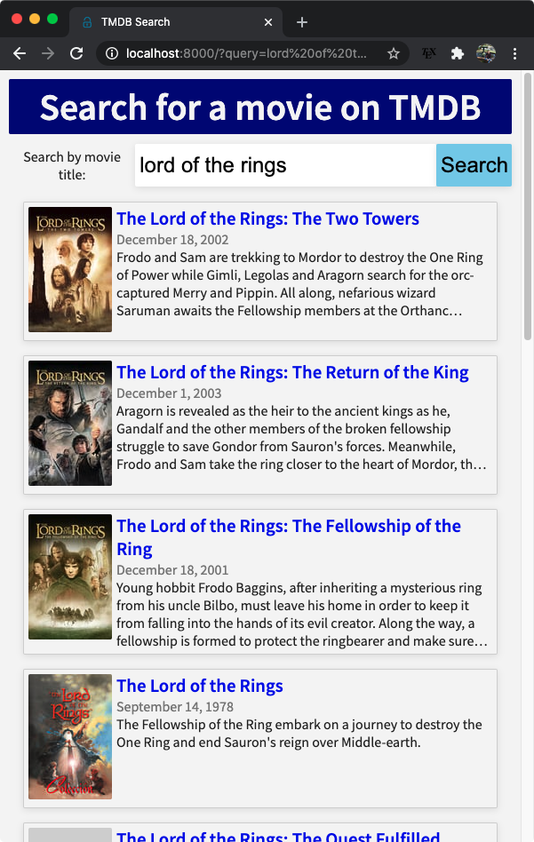
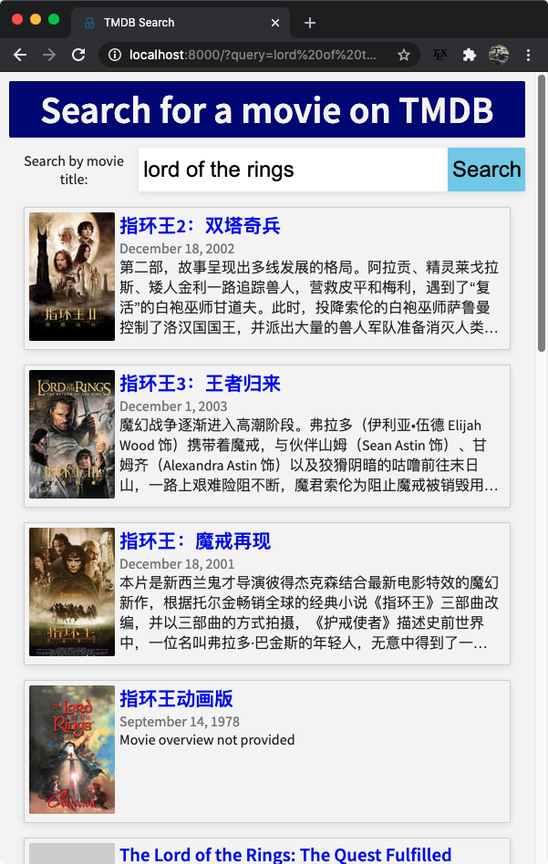
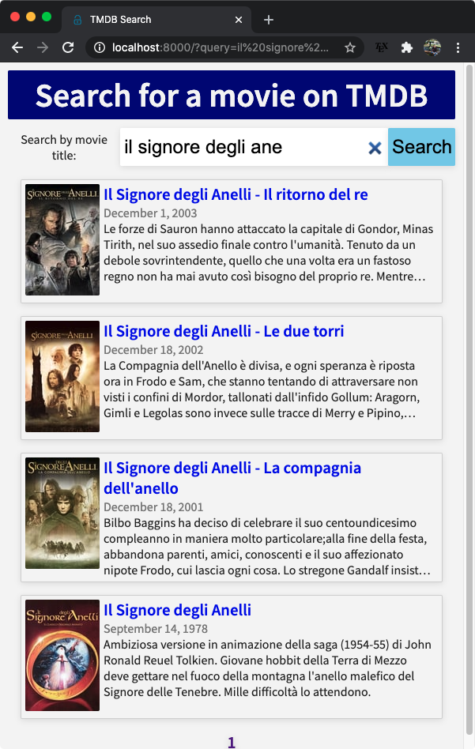
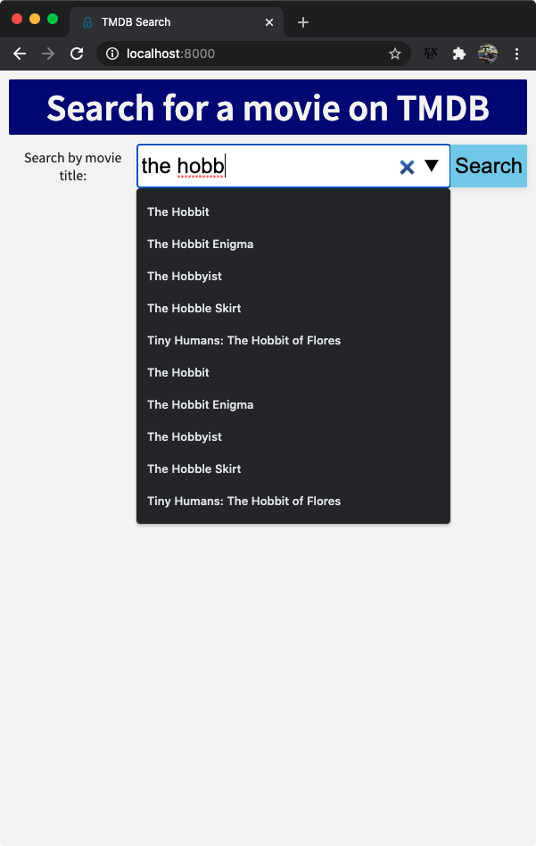
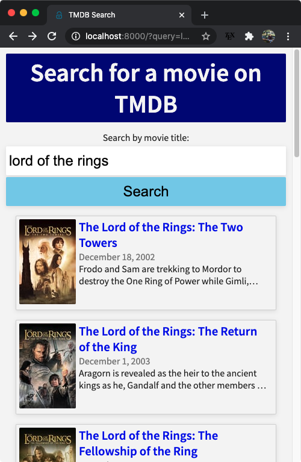

# About

Search for movies by title using the [TMDB][TMDB] api.

# Set up

To run the application on your computer, you'll need an api token from [TMDB][TMDB]; follow the link for details.

Set `TMDB_API_TOKEN` as an environment variable to your api token; the application reads the token from the environment.
In bash or zsh,
```bash
export TMDB_API_TOKEN=<your token>
```
and in a fish shell
```fish
set -x TMDB_API_TOKEN <your token>
```

Run `npm install` to install the dependencies and then `npm run devstart` to run a local server.
The devstart command uses nodemon to watch for file changes and automatically restart the server.


By default the server will listen on port 8000, but you you can change this to another port by setting a `PORT` environment variable,
e.g. `export PORT=3000`.


# Features

* As the user types in the search box, suggested movie titles are shown in an auto-complete menu
* Movie descriptions will be show in the language specified by `navigator.language`
* The user can view all the paginated search results
* Each result links to the full detail page on the TMDB website.
* Designed for all screen widths
* Smoothly handles missing api data, e.g. no movie poster or overview.

Language aware:





Completion menu and mobile layout:





# Discussion
With the core functionality of the site being relatively simple, I decided to keep the dependencies/frameworks
to a minimum and focus initially on setting up a clear line of communication between the front end, back end,
and the TMDB api. I chose to use express.js to manage the back end because I haven't used it before, but it can be used
to set up a simple server that easily meets the needs of this project. I also wanted to challenge myself to implement
the extra features without relying on a framework (though I am usually happy to use one).

There are two routes managed by express in the [server.js](./server.js) file, the root route which serves the html page the user
sees and the '/json' route for ajax requests from the front end.
The main information passed between the front and back end is the user's search query and the page of the paginated search
results that the api provides (I used url query strings to pass this information information in both directions).
When a page loads, the front end code in [index.js](./index.js) uses the url query string to determine the search term and result
page to request (if any). If those keys are in the query string, an ajax request to `/json` with the same query string is sent to the server,
which in turn adds in the api token and sends the request to the TMDB api. When the api responds, the server finally forwards the json results
to the front end to render.


[TMDB]: https://developers.themoviedb.org/3/getting-started/introduction
